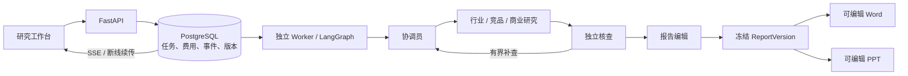

# BriefForge

**从分散资料到可核查的竞品研究报告。** 多个 Agent 围绕一个工作问题并行调查，发现矛盾后补查证据，生成共享同一事实版本的可编辑 Word 和 PowerPoint。

React / TypeScript · FastAPI · LangGraph · PostgreSQL · OpenRouter · python-docx / PptxGenJS

[三分钟演示录像](artifacts/demo/briefforge-demo.webm) · [Word 样例](artifacts/demo/briefforge-ff26ff55-0bb6-4c57-b338-a57361da1b61-v1.docx) · [PPT 样例](artifacts/demo/briefforge-ff26ff55-0bb6-4c57-b338-a57361da1b61-v1.pptx)

这是面向单人办公的本地应用。自带三家明确虚构的办公协作产品、30份资料和12个评测场景。固定响应回放、真实模型研究和公开网页研究分别标识；合成材料及回放表现不代表真实市场准确率或用户时间收益。

## 开始使用

安装 Python 3.12、Node.js 22、uv 和 pnpm。Windows PowerShell：

```powershell
uv sync --frozen --extra dev
pnpm install --frozen-lockfile
pnpm --dir frontend install --frozen-lockfile
pnpm --dir frontend build
.\scripts\start.ps1
```

打开 <http://127.0.0.1:8788>，选择“体验示例研究”。无需模型密钥即可运行明确标识的免费回放。Windows 的后台启动与停止分别使用 `scripts/start-background.ps1` 和 `scripts/stop.ps1`。

`start.ps1` 同时运行API和独立工作进程。没有配置数据库时，提供 SQLite 本地兼容模式；正式 Compose 安装使用 PostgreSQL。界面的健康接口会报告实际数据库。所有本地运行资料存于 `.local/`，不提交版本库。

本次交付在原生 PostgreSQL 16 上实测。当前工作区的启动脚本可恢复已有本地集群；迁移到其他机器使用 Compose 或自行配置数据库连接。不要同时启动占用相同端口的原生 PostgreSQL 与 Compose 数据库。

### PostgreSQL 与 Docker Compose

```powershell
docker compose up --build -d
```

服务包括API、独立Worker和PostgreSQL。API与数据库仅绑定本机地址。开发用数据库凭据已写在Compose中，因此本配置用于个人本机，不直接公开到互联网。

若使用已有数据库，设置 `BRIEFFORGE_DATABASE_URL` 为 SQLAlchemy 的 `postgresql+psycopg://...` URL，再分别启动：

```powershell
uv run briefforge serve
uv run briefforge worker
```

### 真实模型与联网

仅在服务端设置 `OPENROUTER_API_KEY`。界面选择“真实模型”后才会提交收费请求，密钥不进入浏览器、报告或版本库。

- 新研究默认使用已完成真实对照的 `google/gemini-2.5-flash-lite` / `google-ai-studio`。高级选项保留 `qwen/qwen3-235b-a22b-2507` / `gmicloud/fp8` 实验线路，两种配置适用同一价格上限。运行中不自动换模型，已有运行的恢复和修订沿用原配置；不同模型的评测结果分开保存。
- 每次运行先检查工具调用、结构化输出能力及价格。输入/输出价格上限分别为 US$0.10/0.40 每百万 token，不自动切换更贵线路。
- 项目累计上限 US$10，分为开发2、评测4、联网2、修复演示2美元。默认每次资料研究上限0.15美元，联网研究上限0.30美元。
- 所有收费尝试先在数据库中原子预留费用。未知费用继续预留，取消不会把已发生调用记作免费。重置数据库会重置本地账本，因此不要用更换数据库绕过预算。
- 公开资料项目使用真实模型及有次数限制的 OpenRouter 搜索。引用需要实际读取网页正文；获取失败的摘要不能变成已核实事实。

## 日常工作流程

1. 创建研究，设置问题、受众、时间范围、最多四家竞品及比较维度。
2. 导入CSV、XLSX、DOCX、文本型PDF、HTML、TXT或Markdown。单文件最多10MB。公开工作区可关闭“联网搜索公开资料”，仅使用上传资料运行真实模型；此时默认预算为0.15美元。
3. 审阅大纲后运行研究，查看任务进度、证据、冲突和补查过程。
4. 在报告中查看原文，提出修订要求，或替换旧资料后重新研究。
5. 导出同一报告版本的Word和PPT。旧报告与旧来源保持可读。

扫描件OCR、登录网站、多人协作、自动发送邮件和自动定期研究不在首版范围内。

## 系统特点



- 六种职责：协调、行业研究、竞品研究、商业分析、独立核查、报告编辑。最多三项任务并行。
- 首轮专业研究按任务读取相关冻结来源，返回结构化结论；定向补查使用 `search_sources`、`read_sources` 和 `submit_claims`，只能访问冻结来源和限定输出结构。
- LangGraph检查点、持久化任务输出与Worker租约共同实现恢复。旧Worker令牌不能提交后续结果。
- 同一问题最多两轮补查，每项研究最多24个任务、40次收费模型请求。无法解决的冲突保留为待确认。
- 来源版本与结论依赖支持局部更新。新报告冻结资料、事实、条件、引用和图表输入，双格式导出不再调用模型。
- 报告和协作页展示“协作带来的变化”：真实结论变更、核查与补查依据、负责角色、任务并行区间、局部更新复用数量。历史未记录的指标保持为空；变更次数不代表正确率，也不虚构节省时间。
- 明确的价格原文编译为共同事实字段，币种、单价周期和付款周期保持一致。核查未解决的断言清除单方 `value`，跨章节保留不确定性。无法解析的网页表格仍需要审阅。

## 验证与结果

本次[稳定性改进与完整结果](docs/STABILITY_RESULTS.md)：195 项后端测试、21 项前端测试通过；协作面板展示真实版本差异与复用。最终真实资料更新案例保留 18 条非目标结论，局部更新 3 次模型请求，对照全量重跑 8 次。多 Agent 漏答、误判和编辑失败也完整保留，不以单个演示宣称总体优势。

```powershell
uv run pytest -q
uv run ruff check src tests
pnpm --dir frontend test
pnpm --dir frontend build
uv run python -m briefforge.evaluation --split test --mode replay --out artifacts/evaluation-replay
```

真实评测需要明确指定 live 和付费参数，并使用应用同一数据库账本。回放验证的是实现逻辑；真实运行才能验证模型行为。冻结测试只是一组小型诊断，不支持一般性的多Agent优越性结论。

早期 Qwen 线路出现过限流和工具协议错误；Gemini 配置完成了完整对照与联网试跑，但也暴露了价格单位、套餐解释及漏答问题。后续稳定性改进采用相同资料重测，并增加[独立事实检查与重复诊断](docs/RELIABILITY_PROTOCOL.md)，分别统计回答覆盖、事实一致性、弃答和费用。真实模型成果保留为需审阅的草稿；结果页保留全部失败与历史代码，不预设多 Agent 必然胜出。

原 Word/PPT 样例和三分钟录像采用虚构资料与固定响应回放；新增真实模型草稿样例及逐页版式验收见稳定性结果页。应用在本机原生 PostgreSQL 上通过集成与崩溃恢复验证；当前环境仅验证了 Compose 配置，未实际启动容器。

[架构与设计取舍](docs/ARCHITECTURE.md) · [演示步骤](docs/DEMO.md) · [实测结果](docs/RESULTS.md)

